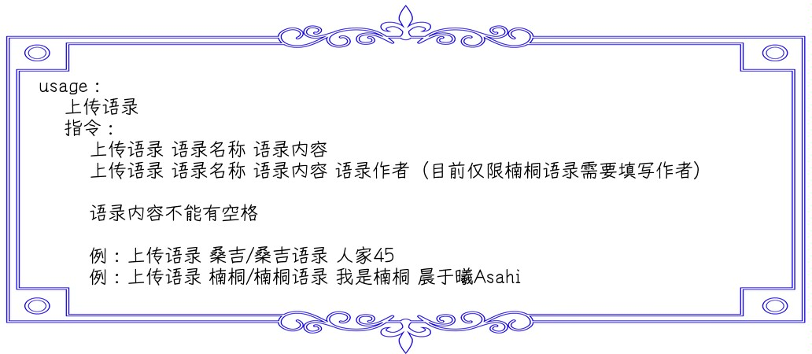
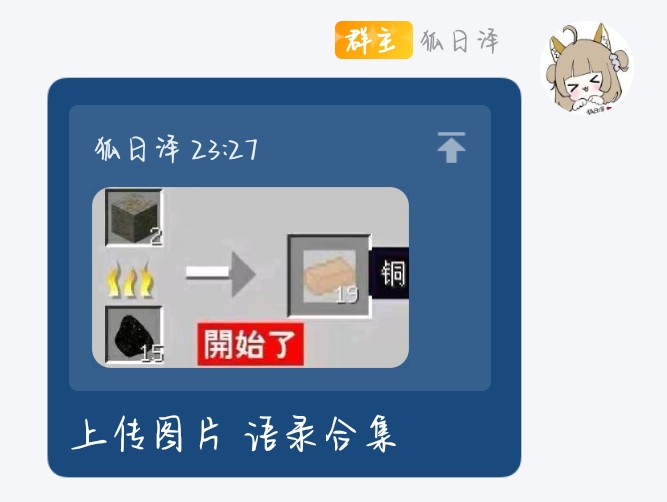

# Sentences Custom Update

 

bot插件扩展，用于快速更新语录库，没有第三方库无需安装依赖

## 如何使用

## ChangeLog

### 语录库更新

- 发送语录支持图片，通过random函数随机抽取

- 修改语录合集上传的图片和其他语录一样为单独的路径避免产生未知的bug

#### 1.0.7 | 2023.7.26

##### add：

- 上传图片支持回复 

#### 1.0.6 | 2023.7.25

##### add：

- 新增查询功能，目前可查询已收录语录列表

##### change：

-  稍微优化了一下代码并移除了未使用的变量

#### 1.0.5 | 2023.7.19

##### change:

- 移除上传语录所需的权限要求

##### fix：

- 修复在同一个进程中多次上传图片时，当前时间不刷新的问题

#### 1.0.4 | 2023.7.19

##### add:

- 上传语录初步支持上传图片，上传的图片将会按照语录分类

#### 1.0.3 | 2023.7.18

##### add:

- 成功上传语录后发送的消息内容新增语录的当前id

##### fix：

- 修复一个逻辑bug，该bug不会影响程序的执行，但会抛出一个异常从而被except捕捉

#### 1.0.2 | 2023.7.17

##### add:

- 刷新数据库通过scu触发，不再通过监测文件变动，之后应该是即时刷新（强制延迟2-5s）而不是延迟30s了

#### 1.0.1

##### add:

- 适配语录合集

#### 1.0.1

##### add:

- 适配小晨语录

#### 1.0.1 | 2023.7.6

##### add:

- 添加权限管理，上传语录现在需要5级以上权限（群管理）

##### fix:

- 修复语录不存在时只会后台报错不会提示的问题

#### 1.0.0 | 2023.7.6